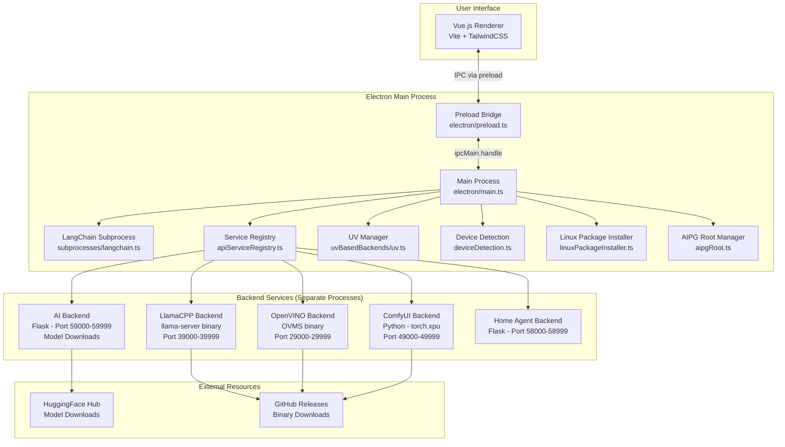
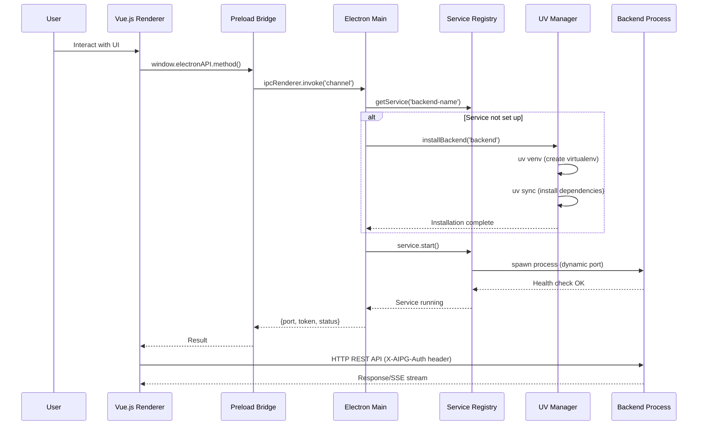
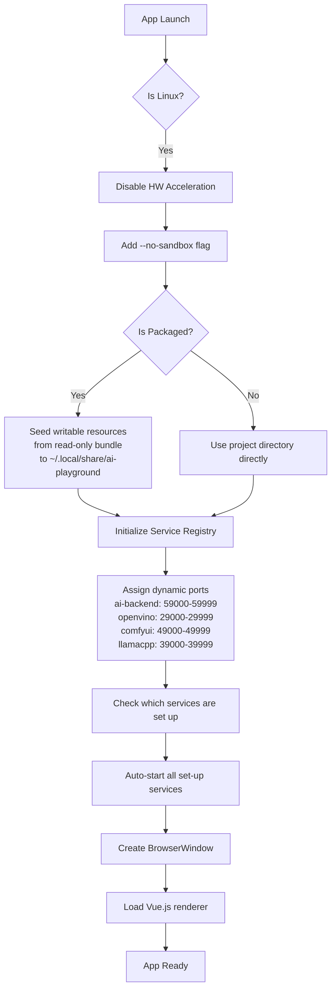
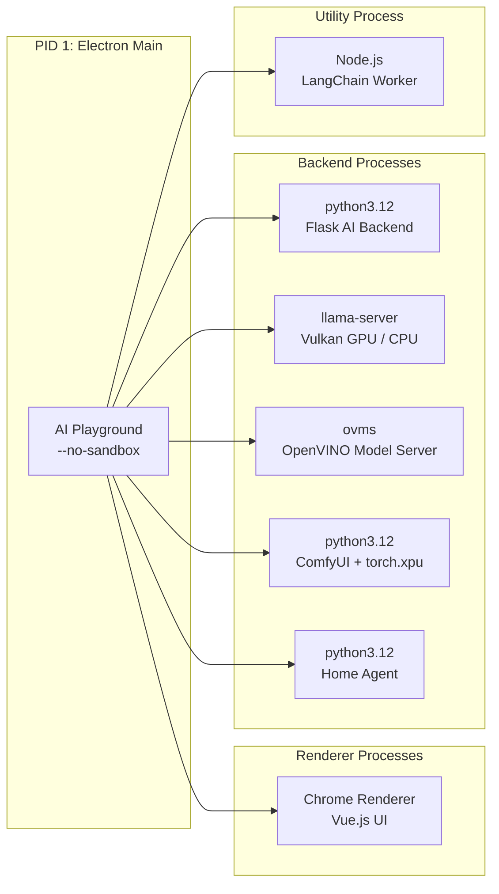
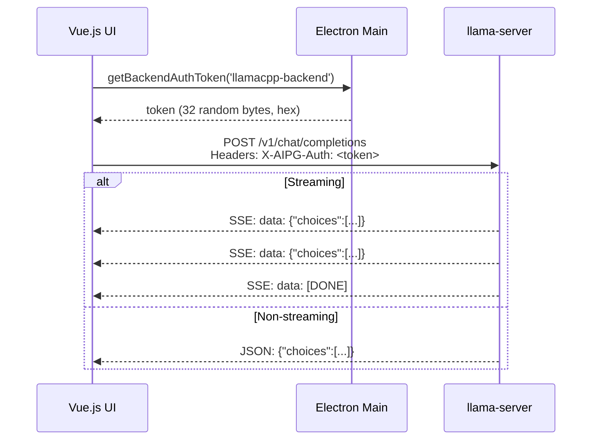
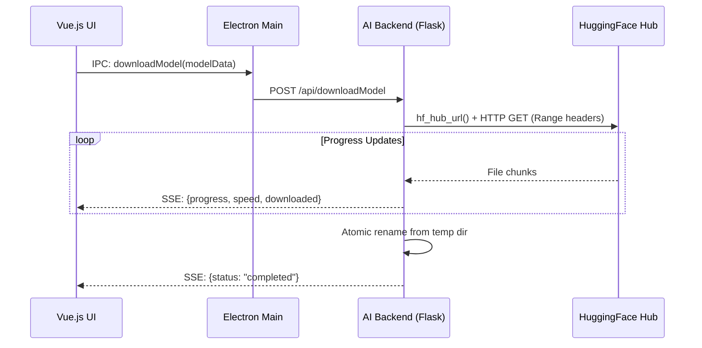

# Architecture Overview

## System Design Philosophy

AI Playground is a **multi-process desktop application** that orchestrates AI inference on local hardware. The key architectural decisions:

1. **Process isolation** - Each AI engine runs as a separate OS process for crash isolation
2. **Platform abstraction in TypeScript** - All Linux-specific logic lives in the Electron main process (zero shell scripts)
3. **Runtime dependency installation** - Python backends are NOT pre-installed; `uv` creates venvs on first launch
4. **Loopback-only security** - All local APIs are bound to 127.0.0.1 with per-session HMAC tokens

---

## High-Level Architecture Diagram



---

## Component Interaction Flow



---

## Application Startup Sequence (Linux)



---

## Process Architecture (Linux Runtime)



---

## Data Flow: Model Inference Request



---

## Data Flow: Model Download



---

## Directory Layout (Key Paths)

```
AI-Playground/
├── WebUI/                          # Electron + Vue.js frontend
│   ├── electron/                   # Main process TypeScript
│   │   ├── main.ts                 # Entry point, IPC handlers
│   │   ├── preload.ts              # Context bridge (~80 IPC methods)
│   │   ├── aipgRoot.ts             # Linux read-only bundle workaround
│   │   └── subprocesses/           # Backend service managers
│   │       ├── apiServiceRegistry.ts
│   │       ├── llamaCppBackendService.ts
│   │       ├── openVINOBackendService.ts
│   │       ├── comfyUIBackendService.ts
│   │       ├── aiBackendService.ts
│   │       ├── homeAgentBackendService.ts
│   │       ├── deviceDetection.ts       # Linux GPU detection
│   │       ├── linuxPackageInstaller.ts # apt-get integration
│   │       └── uvBasedBackends/
│   │           └── uv.ts           # Python env management
│   ├── src/                        # Vue.js renderer (components, stores)
│   ├── build/                      # Build configs and scripts
│   │   ├── build-config.json       # electron-builder config
│   │   └── scripts/                # Build automation
│   ├── external/                   # Bundled configs and catalogs
│   │   ├── backend-versions.json   # Pinned backend versions
│   │   ├── models.json             # Model catalog
│   │   └── model_config.json       # Model path configuration
│   └── package.json                # npm project definition
├── service/                        # Python: model download service
├── comfyui-deps/                   # Python: ComfyUI dependencies + custom nodes
├── home-agent/                     # Python: Telegram/Slack bridge
├── OpenVINO/                       # Python: device detection utility
├── modes/                          # Product mode configs (studio/essentials/nvidia)
└── .python-version                 # Pins Python 3.12.13
```
