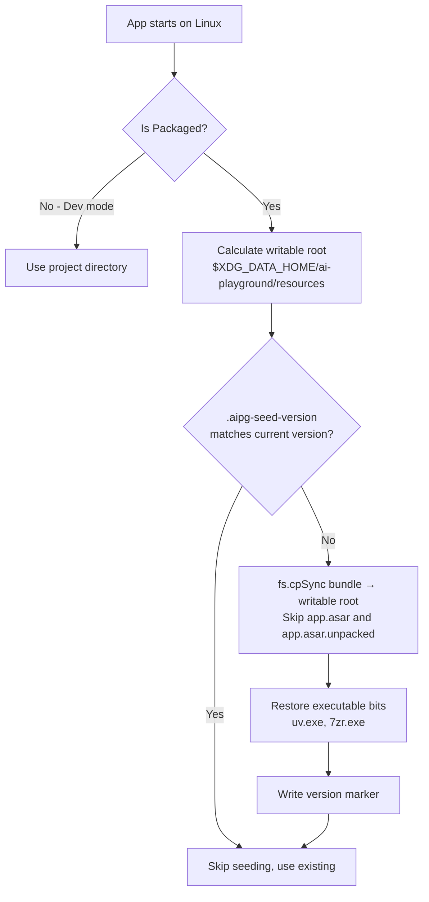
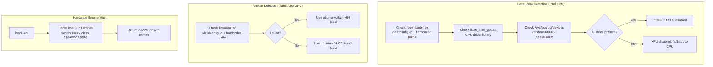
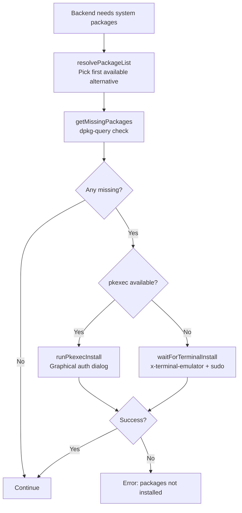
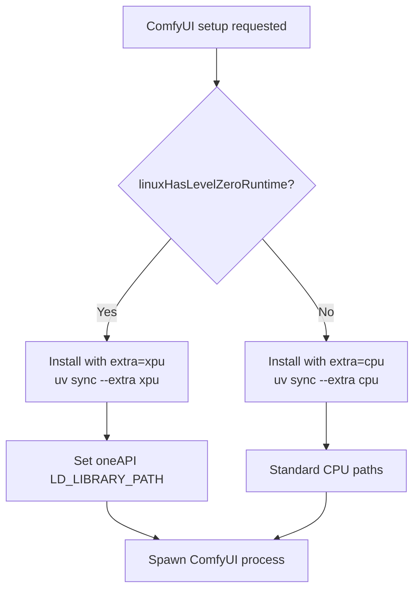

# Linux Implementation Deep Dive

## Overview

All Linux-specific logic is implemented in TypeScript within the Electron main process. There are **zero shell scripts** (.sh files) in the project. Linux adaptations are detected at runtime via `process.platform === 'linux'` checks throughout the codebase.

---

## Linux Startup Adaptations

**File:** `WebUI/electron/main.ts` (lines 197-203)

```typescript
if (process.platform === 'linux') {
  app.disableHardwareAcceleration()  // Avoid Chromium GPU process crashes
  app.commandLine.appendSwitch('disable-gpu')
  app.commandLine.appendSwitch('no-sandbox')  // Required for non-root Chromium
}
```

**Why:** Chromium's GPU process conflicts with Level Zero/SYCL/Vulkan being used by the AI backends. Disabling it ensures the GPU is exclusively available for AI inference.

---

## Read-Only Bundle Relocation

**File:** `WebUI/electron/aipgRoot.ts`

**Problem:** Linux AppImage mounts as a read-only squashfs filesystem. The app needs to write backends, venvs, and model configs at runtime.

**Solution:** On first launch (per app version), the bundled resources are copied to a writable user directory:



**Default writable path:** `~/.local/share/ai-playground/resources/`

**Key design details:**
- Copies only shipped files (not `app.asar`)
- Runtime-created directories (venvs, models) are preserved across version upgrades
- Executable bits are explicitly restored for bundled binaries (`chmod 0o755`)

---

## GPU Detection Pipeline

**File:** `WebUI/electron/subprocesses/deviceDetection.ts`

### Detection Strategy



### Shared Library Detection Logic

The detection is distro-agnostic:

1. **Hardcoded paths** (Debian/Ubuntu): `/usr/lib/x86_64-linux-gnu/libze_loader.so.1`
2. **Arch/Fedora paths**: `/usr/lib/libze_loader.so.1`, `/usr/lib64/libze_loader.so.1`
3. **ldconfig cache**: `ldconfig -p` output is searched as a fallback

Results are cached per session to avoid repeated filesystem/process calls.

### PCI Device Detection

Reads `/sys/bus/pci/devices/*/vendor` and `/sys/bus/pci/devices/*/class` directly:
- Intel vendor ID: `0x8086`
- Display classes: `0x0300xx` (VGA), `0x0302xx` (3D), `0x0380xx` (Other display)

---

## Linux Package Installer

**File:** `WebUI/electron/subprocesses/linuxPackageInstaller.ts`

Provides apt-based system dependency installation with privilege escalation.

### Package Installation Flow



### Package Alternatives

Some packages have different names across Ubuntu versions:

| Purpose | Ubuntu 24.04+ | Older Ubuntu |
|---------|---------------|--------------|
| FUSE support | `libfuse2t64` | `libfuse2` |
| Python 3.12 | `libpython3.12t64` | `libpython3.12` |
| Level Zero loader | `libze1` | `level-zero` |
| Intel GPU driver | `libze-intel-gpu1` | `intel-level-zero-gpu` |

The `resolvePackageList()` function checks `apt-cache show` to determine which alternative exists on the current system.

---

## Backend-Specific Linux Adaptations

### LlamaCPP on Linux

**File:** `WebUI/electron/subprocesses/llamaCppBackendService.ts`

| Condition | Build Selected | GPU API |
|-----------|---------------|---------|
| Vulkan loader present | `ubuntu-vulkan-x64` | Vulkan compute |
| Vulkan loader absent | `ubuntu-x64` | CPU only |

- Downloads as `.tar.gz` (not `.zip` like Windows)
- GPU selection via `GGML_VK_VISIBLE_DEVICES` environment variable
- Binary detection: `llama-server --list-devices` to enumerate GPUs

### OpenVINO (OVMS) on Linux

**File:** `WebUI/electron/subprocesses/openVINOBackendService.ts`

Required system packages:
```
python3, python3-venv, libtbb12, libhwloc15, libgomp1, 
libnuma1, ocl-icd-libopencl1, libfuse2t64|libfuse2
```

Special handling:
- OVMS binary is linked against `libpython3.12.so.1.0`
- Uses `ensureManagedPython('3.12')` to provision a compatible CPython
- Resolves `LD_LIBRARY_PATH` via `ldconfig -p` for the managed Python's libdir
- Device detection via `OpenVINO/detect_devices.py` (runs in a uv-managed venv)

### ComfyUI on Linux with Intel GPU

**File:** `WebUI/electron/subprocesses/comfyUIBackendService.ts`

Level Zero dependency packages:
```
libze1 | level-zero
libze-intel-gpu1 | intel-level-zero-gpu
```

Environment variables set:
```bash
ZE_FLAT_DEVICE_HIERARCHY=COMPOSITE
ONEAPI_DEVICE_SELECTOR=level_zero:*
LD_LIBRARY_PATH=/opt/intel/oneapi/mkl/latest/lib:/opt/intel/oneapi/tbb/latest/lib:...
```

Decision logic:


---

## The --no-sandbox Wrapper

**File:** `WebUI/build/scripts/after-pack.cjs`

**Problem:** Electron on Linux requires either a setuid sandbox binary (owned by root) or `--no-sandbox`. AppImage users can't set up setuid.

**Solution (after-pack hook):**
1. Renames the real Electron binary: `ai-playground` → `ai-playground.bin`
2. Creates a shell script wrapper at the original name:
   ```bash
   #!/bin/bash
   exec "$(dirname "$0")/ai-playground.bin" --no-sandbox "$@"
   ```
3. This ensures `--no-sandbox` is always passed, even from desktop launchers

---

## File Extraction on Linux

**File:** `WebUI/electron/subprocesses/tools.ts`

| Format | Linux Method |
|--------|-------------|
| `.tar.gz` | `tar -xf <archive> -C <dest>` |
| `.zip` | `extract-zip` npm package |
| `.7z` | Bundled `7zr.exe` binary (works on Linux despite the name) |

After extraction, `restoreTreeWritePermissions()` ensures all extracted files are writable (tarballs can have restrictive permissions).

---

## Git Integration on Linux

**File:** `WebUI/electron/subprocesses/service.ts`

- Uses system git at `/usr/bin/git` (no bundled portable git)
- If git is missing: throws error with message "Install it with your package manager"
- Git is required for ComfyUI backend (clones the ComfyUI repo)
- Listed as a `.deb` package dependency

---

## Linux-Specific Configuration

### .deb Package Dependencies
```json
["libdbus-1-3", "libgtk-3-0", "libnss3", "libasound2", "pciutils", "python3", "git"]
```

### Desktop Entry
```
Name=AI Playground
Comment=AI inference desktop app for Intel GPUs
Categories=Utility;Graphics;Development;
```

### AppImage Behavior
- Self-contained, no install needed
- FUSE required (`libfuse2`) for mounting
- Read-only squashfs → resources relocated to `~/.local/share/`
