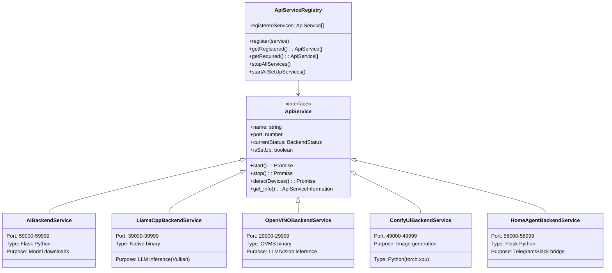
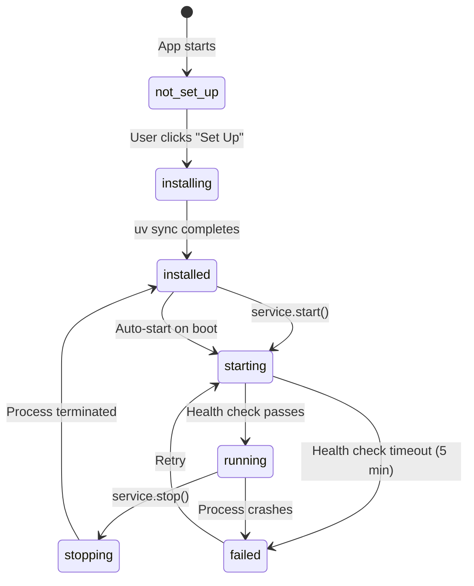
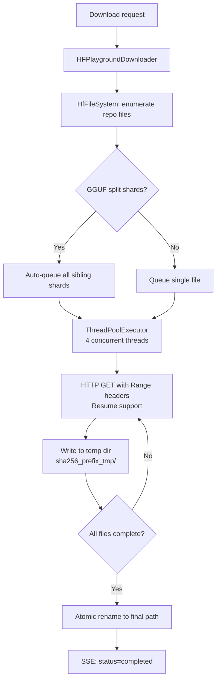
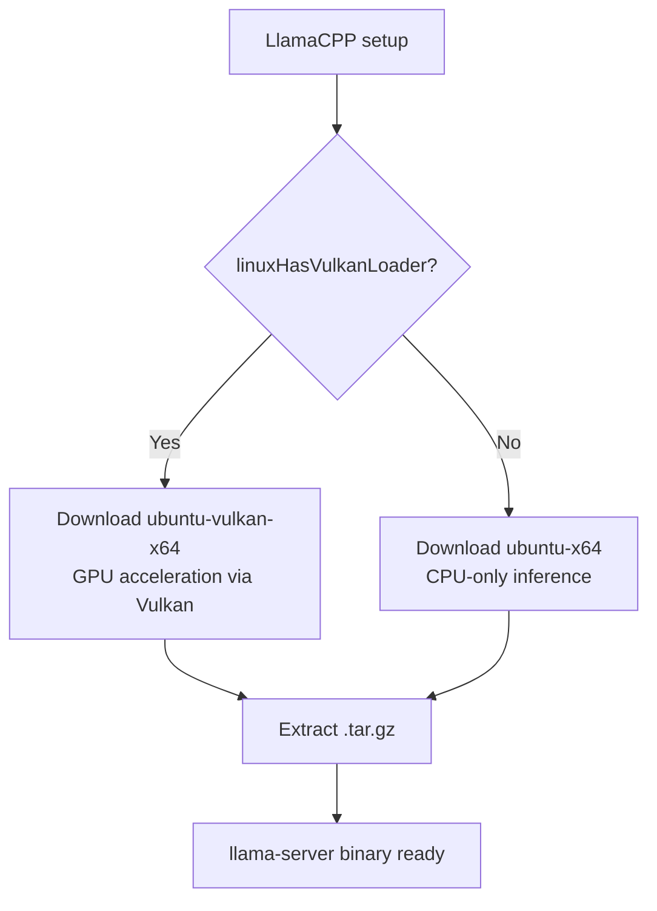
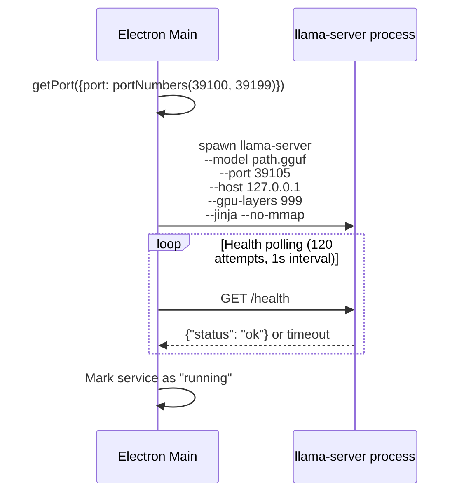
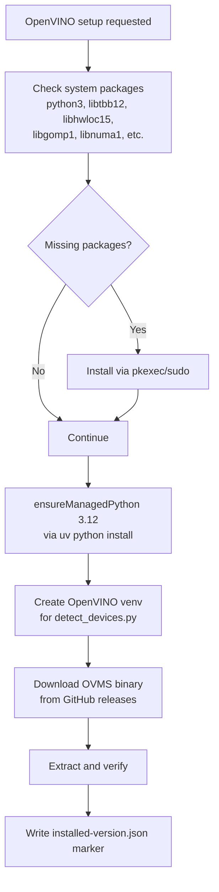
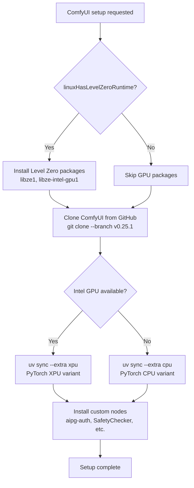
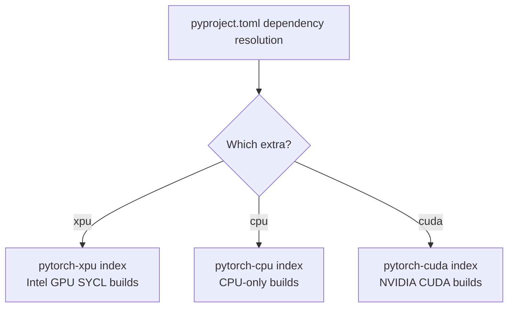
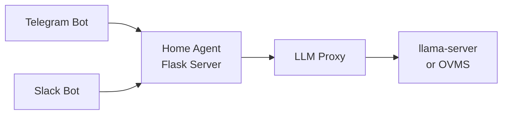

# Backend Services

## Service Registry Architecture

All backend services are managed through a central registry pattern.

**File:** `WebUI/electron/subprocesses/apiServiceRegistry.ts`



---

## Service Lifecycle



---

## 1. AI Backend Service (Model Downloads)

**Type:** Python Flask server  
**Port Range:** 59000-59999  
**Source:** `service/web_api.py`  
**Dependencies:** `service/pyproject.toml` (Flask, apiflask, huggingface_hub, psutil)

### Purpose
Orchestrates model downloads from HuggingFace Hub. This is the only service that is **always required** (marked as "required" in the registry).

### Key Endpoints

| Method | Path | Purpose |
|--------|------|---------|
| POST | `/api/downloadModel` | Start model download (returns SSE stream) |
| POST | `/api/cancelDownload` | Cancel in-progress download |
| GET | `/api/modelExists` | Check if model already downloaded |
| POST | `/api/checkGatedModelAccess` | Verify HF token has gated model access |

### Download Architecture



### Model Path Convention
```
models/LLM/ggufLLM/<namespace>---<repo>/<filename>.gguf
```
The `/` in HuggingFace repo IDs is replaced with `---` for filesystem safety.

---

## 2. LlamaCPP Backend Service

**Type:** Native binary (`llama-server`)  
**Port Range:** 39000-39999 (LLM), 39200-39299 (embedding)  
**Source:** `WebUI/electron/subprocesses/llamaCppBackendService.ts`  
**Binary Source:** GitHub releases (`ggml-org/llama.cpp`)

### Linux Build Selection



### Process Spawning (per model)

Each loaded model gets its own `llama-server` process:



### Key Parameters
```
--gpu-layers 999    # Offload all layers to GPU
--jinja             # Enable Jinja2 chat templates
--no-mmap           # Don't memory-map (more predictable on Linux)
-fa off             # Flash attention off by default
--host 127.0.0.1   # Loopback only (security)
```

### GPU Device Selection
- Environment: `GGML_VK_VISIBLE_DEVICES=0` (Vulkan device index)
- Detection: `llama-server --list-devices` parses available Vulkan GPUs

---

## 3. OpenVINO Backend Service (OVMS)

**Type:** Native binary (OpenVINO Model Server)  
**Port Range:** 29000-29999  
**Source:** `WebUI/electron/subprocesses/openVINOBackendService.ts`  
**Binary Source:** GitHub releases (intel/AI-Playground, tag from `backend-versions.json`)

### Setup Flow on Linux



### OVMS Process Architecture

OVMS spawns **separate processes** for different model types:

| Instance | Purpose | Port Range |
|----------|---------|-----------|
| LLM | Text generation | 29000-29099 |
| Embedding | Text embeddings | 29100-29199 |
| STT | Speech-to-text | 29200-29299 |
| TTS | Text-to-speech | 29300-29399 |
| Image Gen | Image generation | 29400-29499 |

### Linux-Specific Environment
```bash
LD_LIBRARY_PATH=<managed-python-libdir>:<existing>
PYTHONPATH=<target-dir-with-jinja2>
```

OVMS links against `libpython3.12.so.1.0`, requiring the managed CPython's lib directory on `LD_LIBRARY_PATH`.

### Device Detection
Runs `OpenVINO/detect_devices.py` in the OpenVINO venv:
```python
from openvino import Core
core = Core()
devices = core.available_devices  # ['CPU', 'GPU.0', 'NPU']
```

---

## 4. ComfyUI Backend Service

**Type:** Python application (PyTorch)  
**Port Range:** 49000-49999  
**Source:** `WebUI/electron/subprocesses/comfyUIBackendService.ts`  
**Repository:** Cloned from GitHub (`comfyanonymous/ComfyUI`)

### Setup Flow on Linux



### ComfyUI Dependencies (`comfyui-deps/pyproject.toml`)

This is the heaviest backend with 80+ Python packages:
- **torch 2.12.1** - Core ML framework
- **transformers** - HuggingFace model loading
- **diffusers** - Stable Diffusion pipelines
- **safetensors** - Safe model serialization
- **accelerate** - Distributed inference
- **opencv-python** - Image processing
- Plus many ComfyUI-specific packages

### PyTorch Index Selection (Linux)



### Custom Nodes

Located in `comfyui-deps/custom_nodes/`:

| Node | Purpose |
|------|---------|
| `aipg-auth` | Loopback authentication middleware |
| `OpenAICompatibleImageGen` | OpenAI API-compatible image generation |
| `OpenVINOImageUpscale` | RealESRGAN upscaling via OpenVINO |
| `SafetyChecker` | NSFW content detection |

### Runtime Environment Variables
```bash
ZE_FLAT_DEVICE_HIERARCHY=COMPOSITE
ONEAPI_DEVICE_SELECTOR=level_zero:*
LD_LIBRARY_PATH=/opt/intel/oneapi/mkl/latest/lib:/opt/intel/oneapi/tbb/latest/lib
```

---

## 5. Home Agent Backend Service

**Type:** Python Flask server  
**Port Range:** 58000-58999  
**Source:** `home-agent/web_api.py`  
**Dependencies:** Flask, flask-cors, python-telegram-bot, slack-bolt

### Purpose
Bridges external messaging channels (Telegram, Slack) to the local LLM backend.

### Architecture



### Channel Registry Pattern
- `channels/base.py` - Abstract channel interface
- `channels/telegram.py` - Telegram bot implementation
- `channels/slack.py` - Slack bolt app
- `channels/audio.py` - Audio I/O channel
- `channels/registry.py` - Channel discovery and lifecycle

---

## Authentication & Security

All backends share a common security model:

```mermaid
flowchart TD
    A[Service starts] --> B[Generate 32 random bytes<br/>crypto.randomBytes(32).toString('hex')]
    B --> C[Pass as env: AIPG_LOOPBACK_TOKEN]
    C --> D[Backend validates every request]
    D --> E{X-AIPG-Auth header matches?}
    E -->|Yes| F[Process request]
    E -->|No| G[401 Unauthorized]
    
    H[Also enforced:] --> I[Bind to 127.0.0.1 only]
    H --> J[Reject non-loopback source IPs]
```

---

## Health Check Protocol

Each backend type has a different health endpoint:

| Backend | Health Endpoint | Protocol |
|---------|----------------|----------|
| AI Backend (Flask) | `GET /healthy` | HTTP 200 |
| LlamaCPP | `GET /health` | HTTP 200 with `{"status":"ok"}` |
| OpenVINO (OVMS) | `GET /v2/health/ready` | HTTP 200 |
| ComfyUI | `GET /system_stats` | HTTP 200 |
| Home Agent | `GET /healthy` | HTTP 200 |

Polling: every 250ms during startup, up to 5 minutes timeout.
