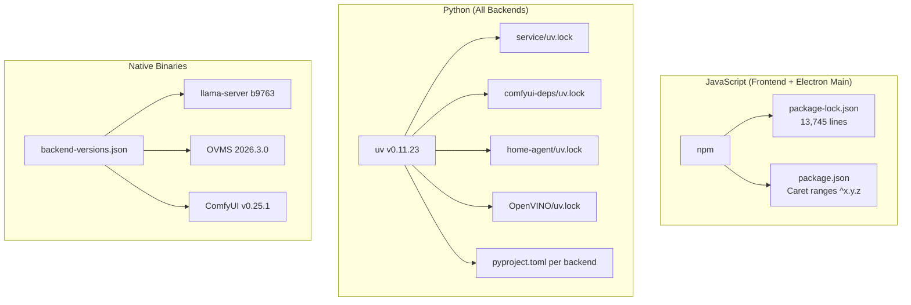
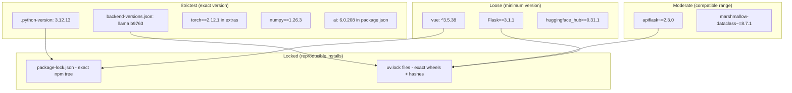
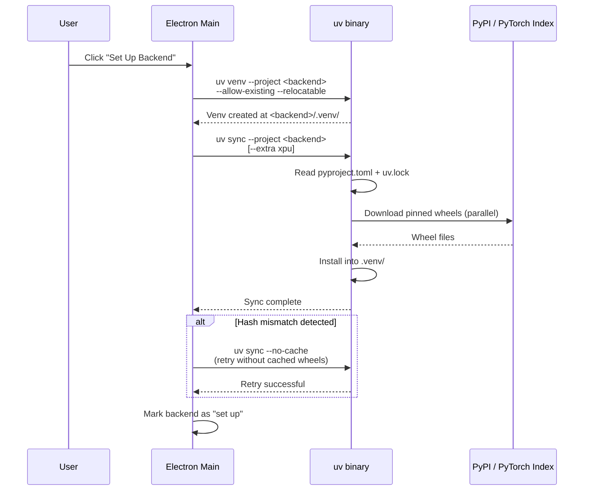

# Dependency & Version Management

## Dual Package Manager Strategy

The project uses two distinct package ecosystems:



---

## JavaScript Dependencies

### package.json Version Strategy

**File:** `WebUI/package.json`

| Strategy | Example | When Used |
|----------|---------|-----------|
| Caret `^` | `"vue": "^3.5.38"` | Most deps (allows minor/patch updates) |
| Exact pin | `"ai": "6.0.208"` | Critical deps with breaking changes |
| Overrides | `"@napi-rs/canvas": "^0.1.65"` | Force transitive dependency versions |

### Key Frontend Dependencies

```
@ai-sdk/openai          ^3.0.74     AI SDK for OpenAI-compatible APIs
@ai-sdk/vue             ^3.0.208    Vue.js bindings for AI SDK
@langchain/core         ^1.2.0      LangChain framework
vue                     ^3.5.38     UI framework
pinia                   ^3.0.4      State management
electron                42          Desktop runtime (devDep)
vite                    8           Build tool (devDep)
typescript              6           Type system (devDep)
tailwindcss             4           CSS framework (devDep)
```

### Lockfile: `package-lock.json`
- lockfileVersion: 3
- 13,745 lines
- Pins exact resolved versions + integrity hashes
- Installed via `npm ci` (CI) or `npm install` (dev)

---

## Python Dependencies

### UV as Universal Python Tool

**Bundled version:** 0.11.23  
**Binary location:** `build/resources/uv.exe` (all platforms, despite `.exe` extension)

UV handles:
1. **Python interpreter management** - `uv python install 3.12`
2. **Virtual environment creation** - `uv venv`
3. **Dependency resolution & install** - `uv sync`
4. **Package verification** - `uv sync --check`
5. **Wheel installation** - `uv pip install`

### Python Version Pinning

**File:** `.python-version`
```
3.12.13
```

All backends require Python 3.12 exactly (defined in each `pyproject.toml`).

### Backend Dependency Breakdown

#### Service Backend (`service/pyproject.toml`)

```toml
[project]
name = "aipg-default-backend"
version = "3.0.3-beta"
requires-python = "==3.12.*"

dependencies = [
    "Flask>=3.1.1",
    "apiflask~=2.3.0",
    "marshmallow-dataclass~=8.7.1",
    "psutil>=7.0.0",
    "Requests>=2.32.3",
    "setuptools>=75.8.2",
    "huggingface_hub>=0.31.1",
]
```

**Linux PyTorch source:**
```toml
[tool.uv.sources]
torch = [
    { index = "pytorch-cpu", marker = "sys_platform != 'win32'" },
]
```

#### ComfyUI Backend (`comfyui-deps/pyproject.toml`)

```toml
[project]
name = "aipg-comfyui"
version = "0.17.0"
requires-python = "==3.12.*"

[project.optional-dependencies]
xpu = ["torch==2.12.1", "torchvision==0.22.1", "torchaudio==2.12.1"]
cpu = ["torch==2.12.1", "torchvision==0.22.1", "torchaudio==2.12.1"]
cuda = ["torch==2.12.1", "torchvision==0.22.1", "torchaudio==2.12.1"]
```

**Platform-specific index routing:**
```toml
[[tool.uv.index]]
name = "pytorch-xpu"
url = "https://download.pytorch.org/whl/xpu"

[[tool.uv.index]]
name = "pytorch-cpu"
url = "https://download.pytorch.org/whl/cpu"

[[tool.uv.index]]
name = "pytorch-cuda"
url = "https://download.pytorch.org/whl/cu130"
```

The `[tool.uv.sources]` section uses platform markers to route to the correct index:
```toml
[tool.uv.sources]
torch = [
    { index = "pytorch-xpu", marker = "sys_platform == 'win32'", extra = "xpu" },
    { index = "pytorch-xpu", marker = "sys_platform == 'linux'", extra = "xpu" },
    { index = "pytorch-cpu", marker = "sys_platform == 'darwin'", extra = "xpu" },
    { index = "pytorch-cpu", extra = "cpu" },
    { index = "pytorch-cuda", extra = "cuda" },
]
```

---

## Version Pinning Hierarchy



---

## UV Lock Files

Each backend has its own `uv.lock` that pins:
- Exact package versions
- Exact wheel URLs
- SHA256 content hashes
- Platform resolution markers (win32, darwin, linux)
- Upload timestamps

| Lock File | Lines | Packages |
|-----------|-------|----------|
| `service/uv.lock` | 671 | ~30 packages |
| `comfyui-deps/uv.lock` | 4,049 | ~200 packages |
| `home-agent/uv.lock` | 498 | ~25 packages |
| `OpenVINO/uv.lock` | 210 | ~10 packages |

### UV Lock File Format

```toml
[[package]]
name = "torch"
version = "2.12.1"
source = { registry = "https://download.pytorch.org/whl/xpu" }
resolution-markers = ["sys_platform == 'linux'"]

[[package.wheels]]
url = "https://download.pytorch.org/whl/xpu/torch-2.12.1%2Bxpu-cp312-cp312-linux_x86_64.whl"
hash = "sha256:abc123..."
upload-time = "2026-05-15T10:30:00Z"
```

---

## Backend Version Management

**File:** `WebUI/external/backend-versions.json`

```json
{
  "comfyui-backend": { "version": "v0.25.1" },
  "llamacpp-backend": { "version": "b9763" },
  "openvino-backend": { "version": "2026.3.0", "releaseTag": "8022ddae3" }
}
```

### Remote Version Updates

**File:** `WebUI/electron/remoteUpdates.ts`

On startup, the app fetches the latest versions from GitHub:
```
https://raw.githubusercontent.com/intel/ai-playground/refs/heads/<version>/WebUI/external/backend-versions.json
```

Falls back to bundled versions if the network is unavailable.

### Version Detection

| Backend | How version is detected |
|---------|----------------------|
| LlamaCPP | `llama-server --version` output parsing |
| OpenVINO | `installed-version.json` marker file |
| ComfyUI | Git tag of cloned repository |

---

## Runtime Dependency Installation Flow



---

## Automated Dependency Updates

### Dependabot Configuration

**File:** `.github/dependabot.yml`

| Ecosystem | Directory | Schedule | Group |
|-----------|-----------|----------|-------|
| npm | `/WebUI` | Weekly (Monday 04:00 UTC) | Yes, max 10 PRs |
| uv (pip) | `/comfyui-deps` | Weekly (Monday 04:15 UTC) | Yes, max 10 PRs |

### Build Resource Versions

**File:** `WebUI/build/scripts/build-paths.mts`

Pinned external tool versions:
```typescript
// UV binary
"https://github.com/astral-sh/uv/releases/download/0.11.23/uv-x86_64-unknown-linux-gnu.tar.gz"

// 7-Zip
"https://github.com/nicehash/7zip-static/releases/download/v26.01/7z2601-linux-x64.tar.xz"
```

A `.resource-versions.json` manifest tracks which versions are currently downloaded, enabling cache invalidation when URLs change.

---

## Special Dependency Handling

### Platform-Excluded Packages

In `comfyui-deps/pyproject.toml`:
```toml
# svglib requires pycairo which needs system cairo headers on Linux
# Excluded to avoid build failures on systems without cairo-dev
"svglib>=0.9.6; sys_platform != 'linux'"
```

### Custom Wheel Sources

For packages without pre-built Linux wheels:
```toml
[tool.uv]
no-build = true  # Only use pre-built wheels, never compile from source
```

This is set for `service/` and `home-agent/` to ensure fast, predictable installs.

### Index Strategy
```toml
[tool.uv]
index-strategy = "unsafe-best-match"
```

This allows UV to resolve packages across multiple indexes (PyPI + PyTorch indexes) without strict isolation.
