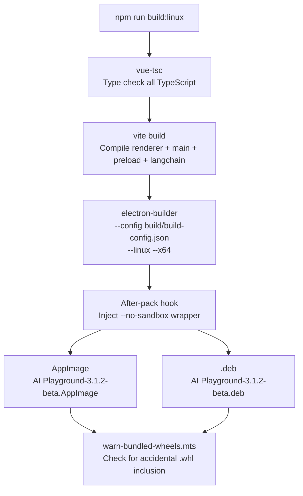
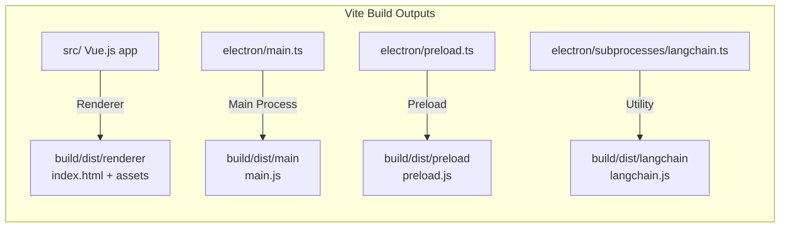
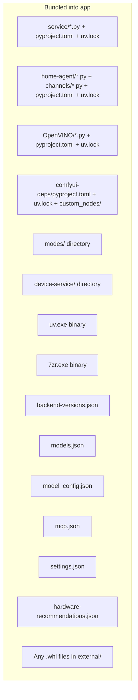
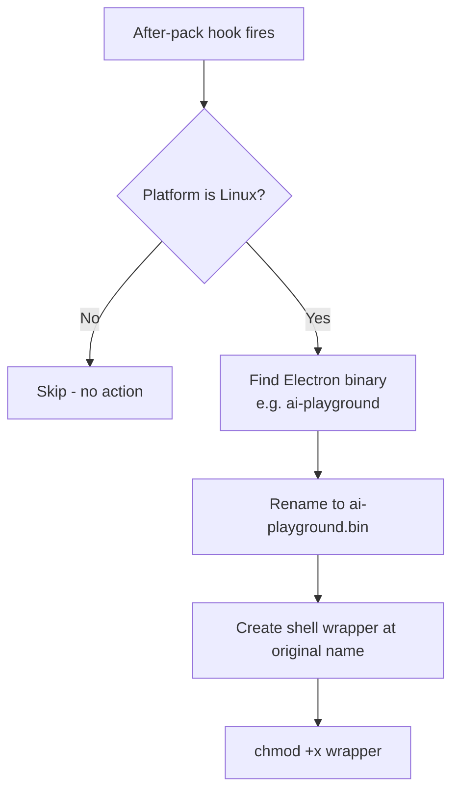
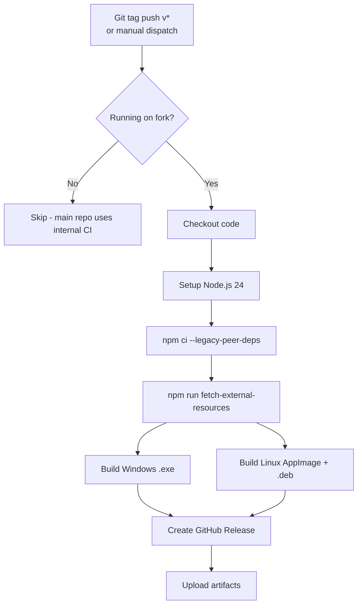
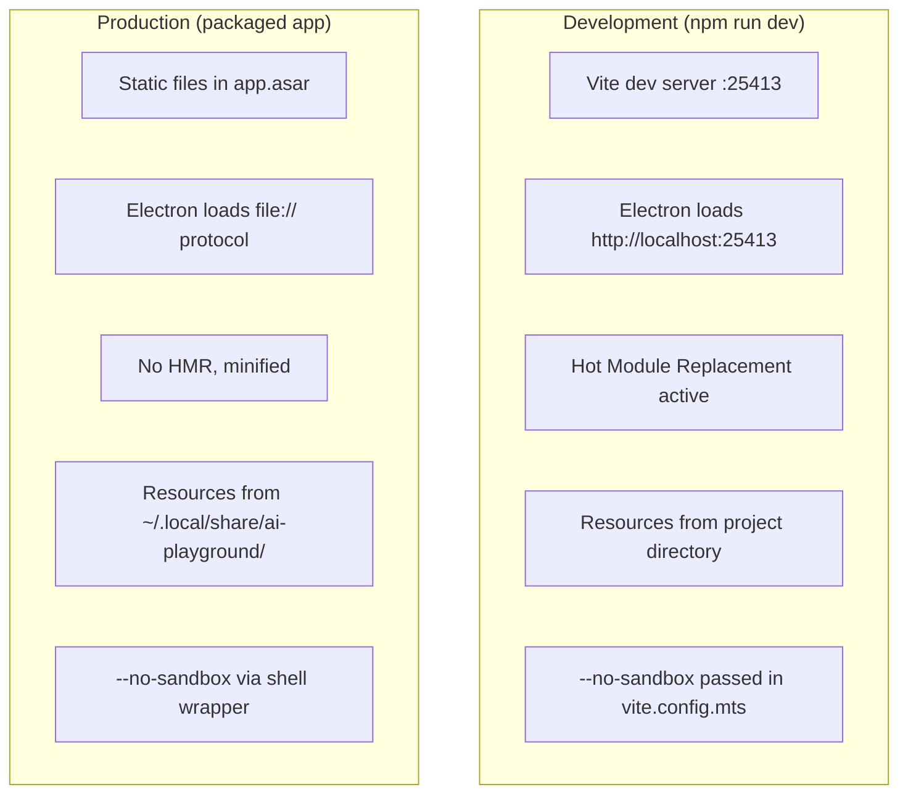

# Build & Distribution (Linux)

## Build Pipeline Overview



---

## Pre-Build: Setup Phase

Before building, developers must run setup:

```bash
cd WebUI
npm run setup
```

This executes:
1. `npm install` - Install node_modules
2. `npm run fetch-external-resources` - Download platform binaries
3. `npm run ensure-electron` - Provision Electron binary
4. `npm run install-hooks` - Install pre-commit hooks

### External Resources Downloaded

**File:** `WebUI/build/scripts/fetch-external-resources.mts`

| Resource | Linux Source | Destination |
|----------|-------------|-------------|
| uv v0.11.23 | `github.com/astral-sh/uv/.../uv-x86_64-unknown-linux-gnu.tar.gz` | `build/resources/uv.exe` |
| 7-Zip v26.01 | `github.com/nicehash/7zip-static/.../7z2601-linux-x64.tar.xz` | `build/resources/7zr.exe` |

Note: Files keep `.exe` extension on Linux for naming consistency across platforms.

The script also checks for C/C++ build toolchain (gcc, g++, make, cmake) on Linux, required for some source-only Python wheels.

### Resource Version Tracking

A `.resource-versions.json` manifest records downloaded versions:
```json
{
  "uv": "0.11.23",
  "7zip": "26.01"
}
```

Re-running `fetch-external-resources` only downloads if versions changed.

---

## Vite Build Phase

**File:** `WebUI/vite.config.mts`

Vite compiles four entry points:



Key Vite configuration for production:
- Output to `../build/dist` (one level above WebUI)
- Minification enabled
- Package.json dependencies are externalized (not bundled into main process)
- `get-port` is the exception - it gets transpiled into the bundle
- TailwindCSS 4 compiled via `@tailwindcss/vite` plugin

---

## Electron-Builder Configuration

**File:** `WebUI/build/build-config.json`

### Linux Targets

```json
{
  "linux": {
    "target": [
      { "target": "AppImage", "arch": ["x64"] },
      { "target": "deb", "arch": ["x64"] }
    ],
    "icon": "build/icons/icon.png",
    "artifactName": "${productName}-${version}.${ext}",
    "category": "Utility",
    "synopsis": "AI inference desktop app for Intel GPUs",
    "vendor": "Intel Corporation",
    "maintainer": "Intel Corporation <webadmin@linux.intel.com>",
    "executableArgs": ["--no-sandbox"],
    "desktop": {
      "entry": {
        "Name": "AI Playground",
        "Comment": "AI inference desktop app for Intel GPUs",
        "Categories": "Utility;Graphics;Development;"
      }
    }
  }
}
```

### .deb Package Dependencies

```json
{
  "deb": {
    "depends": ["libdbus-1-3", "libgtk-3-0", "libnss3", "libasound2", "pciutils", "python3", "git"]
  }
}
```

### Extra Resources Bundled

Everything in `extraResources` is copied alongside the Electron app:



**Critical point:** Python backends are bundled as SOURCE files + lockfiles, NOT as pre-built venvs. The bundled `uv` binary creates venvs at runtime on the user's machine.

---

## After-Pack Hook (Linux Only)

**File:** `WebUI/build/scripts/after-pack.cjs`

This hook runs after electron-builder packages the app but before creating the final distributable:



The wrapper script:
```bash
#!/bin/bash
exec "$(dirname "$0")/ai-playground.bin" --no-sandbox "$@"
```

**Why this is needed:** The `executableArgs` in the electron-builder config only affects the `.desktop` file. When launched from terminal or file manager (AppImage), those args are ignored. The wrapper ensures `--no-sandbox` is always passed.

---

## Output Artifacts

After `npm run build:linux`:

```
build/electron/
├── AI Playground-3.1.2-beta.AppImage    # Portable, no install
├── AI Playground-3.1.2-beta.deb         # For apt/dpkg install
├── AI Playground-3.1.2-beta.AppImage.yml  # Auto-update manifest
└── builder-effective-config.yaml         # Resolved electron-builder config
```

### AppImage Characteristics
- Self-contained, single-file executable
- Requires FUSE (`libfuse2`) to mount the internal squashfs
- Read-only at runtime → app relocates resources to `~/.local/share/ai-playground/`
- No installation needed, just `chmod +x` and run

### .deb Package Characteristics
- Installs to `/opt/AI Playground/`
- Creates desktop entry in `/usr/share/applications/`
- Declares system dependencies (auto-installed via apt)
- Read-only install → same relocation strategy as AppImage

---

## CI/CD: Automated Builds

**File:** `.github/workflows/build-installer.yml`



### Linux Build Runner
- Runs on: `ubuntu-latest`
- Node.js: 24
- Build command: `npm run build:linux`
- Artifacts: AppImage + .deb uploaded to GitHub Release

---

## Development vs Production Paths



### Dev Mode Port Assignments
- Vite dev server: `127.0.0.1:25413`
- API proxy: forwards `/api/` to `:9999`
- Electron debugging port: `29222`
- Backend services: same dynamic ports as production

---

## Build Troubleshooting (Linux)

| Issue | Cause | Fix |
|-------|-------|-----|
| `vue-tsc` fails | TypeScript errors | Fix type errors, run `npm run type-check` |
| electron not found | Missing binary | Run `npm run ensure-electron` |
| uv.exe not executable | Permission lost in build | Check `after-pack.cjs` restores chmod |
| .deb missing deps | New system library needed | Add to `build-config.json` deb.depends |
| AppImage won't start | Missing libfuse2 | Install `libfuse2` or `libfuse2t64` |
| Build hangs | Electron download behind proxy | Set `HTTPS_PROXY` env var |
