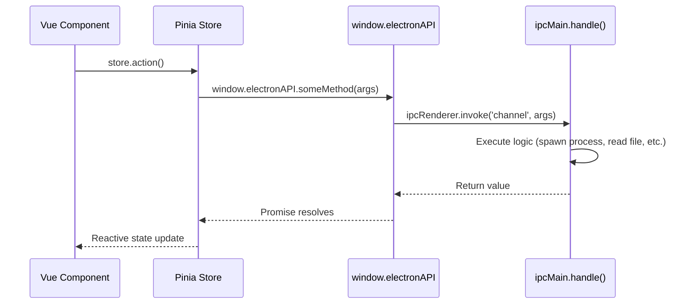
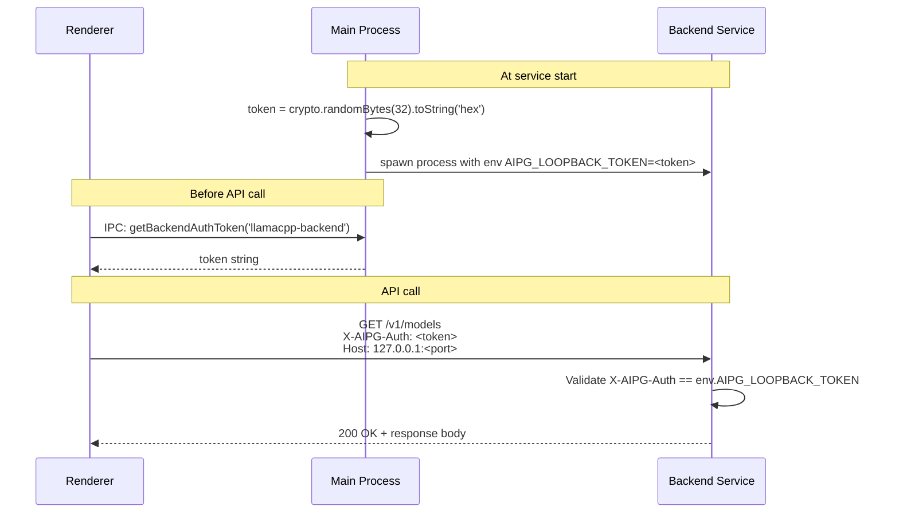
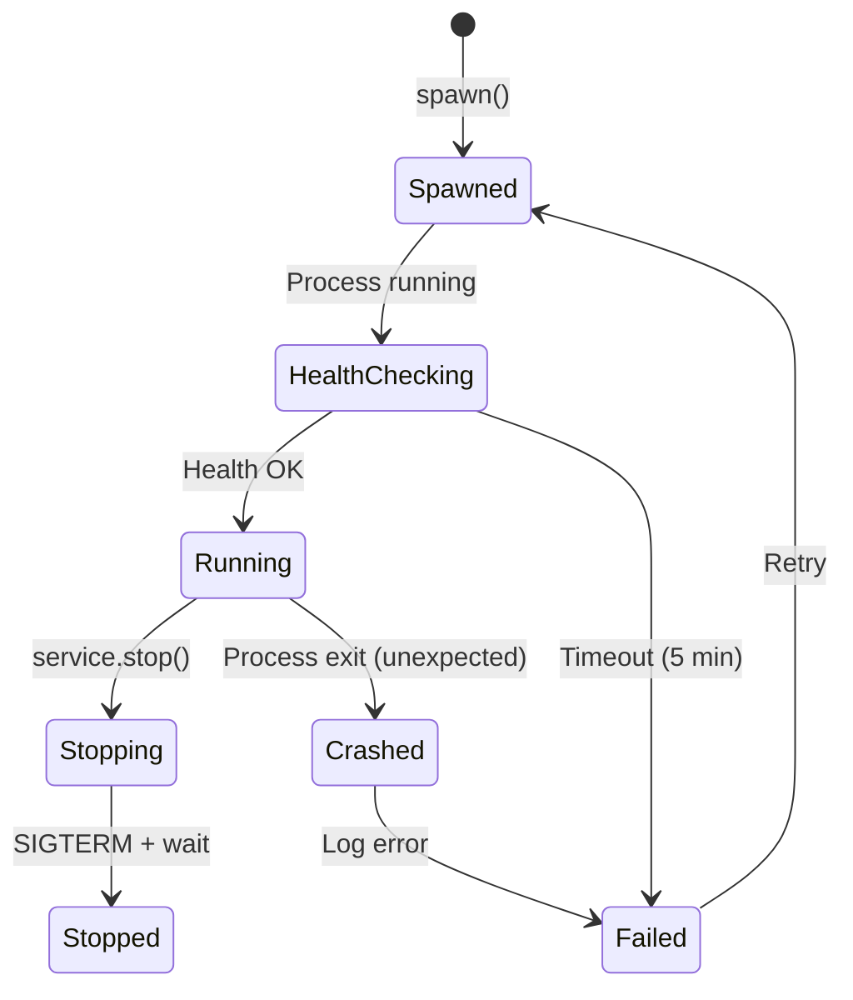
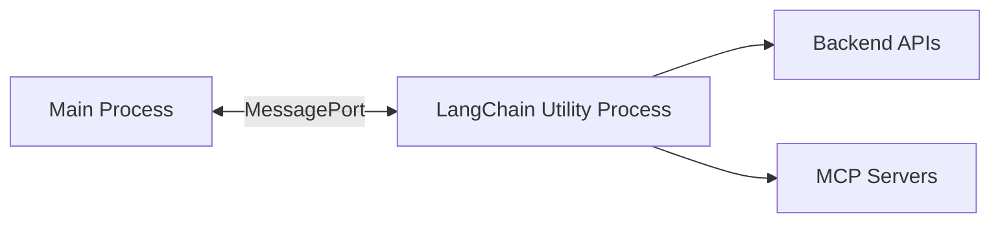
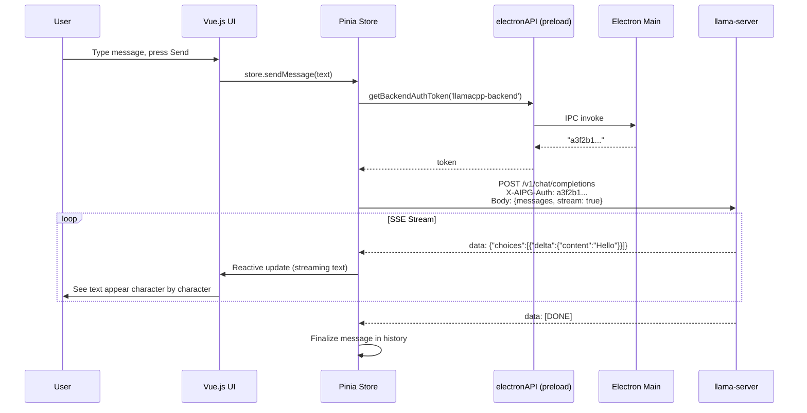
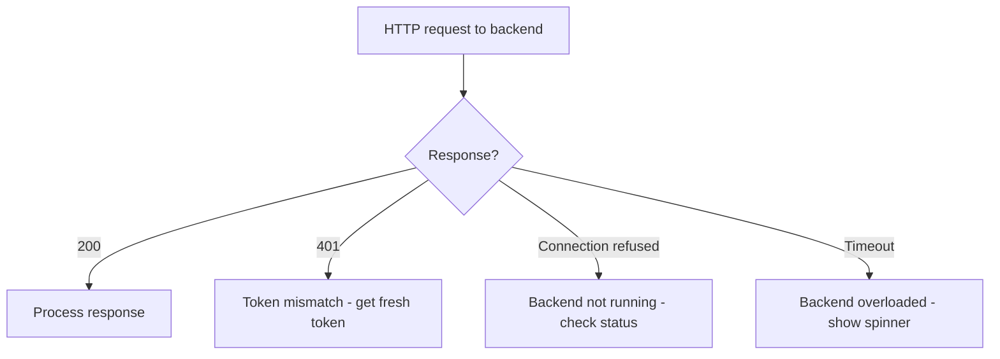

# IPC & Communication

## Communication Layers

The app has three communication layers:

```mermaid
flowchart TD
    subgraph "Layer 1: Electron IPC"
        R[Vue.js Renderer] <-->|ipcRenderer.invoke / ipcMain.handle| M[Electron Main Process]
    end

    subgraph "Layer 2: HTTP REST"
        R -->|fetch() with auth token| B[Backend Services]
    end

    subgraph "Layer 3: Process Control"
        M -->|spawn / kill / signals| B
    end
```

---

## Layer 1: Electron IPC (Renderer ↔ Main)

### Preload Bridge

**File:** `WebUI/electron/preload.ts`

The preload script exposes `window.electronAPI` to the renderer with ~80+ methods. The renderer never has direct access to Node.js or Electron APIs.



### Key IPC Channels

| Channel | Direction | Purpose |
|---------|-----------|---------|
| `getServices` | Renderer → Main | Get all registered service info |
| `startService` | Renderer → Main | Start a specific backend |
| `stopService` | Renderer → Main | Stop a specific backend |
| `setUpService` | Renderer → Main | Install/configure a backend |
| `ensureBackendReadiness` | Renderer → Main | Wait for backend to be ready |
| `detectDevices` | Renderer → Main | Trigger GPU detection |
| `selectDevice` | Renderer → Main | Choose GPU for a backend |
| `getBackendAuthToken` | Renderer → Main | Get auth token for HTTP calls |
| `serviceInfoUpdate` | Main → Renderer | Backend status changed (event) |
| `getModelsBasePath` | Renderer → Main | Get model storage directory |
| `selectDirectory` | Renderer → Main | Open native folder picker |
| `downloadModel` | Renderer → Main | Trigger model download |

### Event-Based Communication (Main → Renderer)

For status updates that originate from the main process:

```typescript
// Main process sends:
win.webContents.send('serviceInfoUpdate', serviceInfo)

// Renderer listens via preload:
window.electronAPI.onServiceInfoUpdate((info) => { ... })
```

---

## Layer 2: HTTP REST (Renderer → Backends)

### Authentication Flow



### Security Enforcement (Backend Side)

Every Flask backend validates:
1. **Auth header** - `X-AIPG-Auth` must match `AIPG_LOOPBACK_TOKEN`
2. **Source IP** - Must be `127.0.0.1` or `::1` (rejects LAN/internet)

### Port Discovery

The renderer doesn't hardcode ports. It discovers them via IPC:

```typescript
// Renderer gets service info including port
const services = await window.electronAPI.getServices()
const llamacpp = services.find(s => s.name === 'llamacpp-backend')
const baseUrl = `http://127.0.0.1:${llamacpp.port}`
```

---

## Layer 3: Process Control (Main → Backends)

### Spawning Backend Processes

```mermaid
flowchart TD
    A[service.start()] --> B[Determine executable path]
    B --> C[Build command-line arguments]
    C --> D[Set environment variables<br/>AIPG_LOOPBACK_TOKEN, LD_LIBRARY_PATH, etc.]
    D --> E[spawn(executable, args, {env, cwd})]
    E --> F[Capture stdout/stderr → app logs]
    F --> G[Poll health endpoint<br/>every 250ms, up to 5 min]
    G --> H{Healthy?}
    H -->|Yes| I[Status: running]
    H -->|Timeout| J[Status: failed]
```

### Process Lifecycle Events



### Signal Handling
- **Normal stop:** `SIGTERM` sent to process group
- **Force stop:** `SIGKILL` after grace period
- **Crash detection:** `child.on('exit', ...)` triggers status update

---

## API Endpoints by Backend

### AI Backend (Flask) - Model Management

```
Base: http://127.0.0.1:<port>  (port 59000-59999)

POST /api/downloadModel
  Body: {models: [{repo_id, type, backend, model_path}]}
  Response: SSE stream with progress updates

POST /api/cancelDownload
  Body: {repo_id}

GET  /api/modelExists?repo_id=...&backend=...

POST /api/checkGatedModelAccess
  Body: {repo_id, token}
  
GET  /healthy
```

### LlamaCPP - OpenAI-Compatible API

```
Base: http://127.0.0.1:<port>  (port 39100-39199 for LLM)

POST /v1/chat/completions
  Body: OpenAI chat completion format
  Response: JSON or SSE stream

POST /v1/embeddings
  Body: {input: "text", model: "..."}

GET  /v1/models
GET  /health
GET  /props
```

### OpenVINO (OVMS) - OpenAI-Compatible API

```
Base: http://127.0.0.1:<port>  (port 29000-29999)

POST /v1/chat/completions
POST /v1/embeddings
GET  /v2/health/ready
```

### ComfyUI - Workflow API

```
Base: http://127.0.0.1:<port>  (port 49000-49999)

POST /prompt
  Body: ComfyUI workflow JSON

GET  /system_stats
GET  /history/<prompt_id>
GET  /view?filename=...&type=output

WebSocket: ws://127.0.0.1:<port>/ws
  Receives: execution progress events
```

### Home Agent - Channel Bridge

```
Base: http://127.0.0.1:<port>  (port 58000-58999)

POST /v1/chat/completions
  (Proxied to upstream LLM backend)

POST /channels/telegram/start
POST /channels/slack/start
GET  /channels/status
GET  /healthy
```

---

## LangChain Subprocess

**File:** `WebUI/electron/subprocesses/langchain.ts`

A separate Node.js process (Electron `utilityProcess`) handles LangChain operations to avoid blocking the main process:



This process handles:
- Multi-step AI tool chains
- MCP (Model Context Protocol) server connections
- RAG (Retrieval Augmented Generation) pipelines
- Complex prompt engineering flows

---

## Data Flow: Complete Chat Request



---

## Error Handling Patterns

### Backend Startup Failure
```mermaid
flowchart TD
    A[Health check fails] --> B[Log error with stderr output]
    B --> C[Set status = 'failed']
    C --> D[Send serviceInfoUpdate to renderer]
    D --> E[UI shows error state with details]
    E --> F{User clicks retry?}
    F -->|Yes| G[service.start() again]
    F -->|No| H[Remain in failed state]
```

### Network Request Failure

