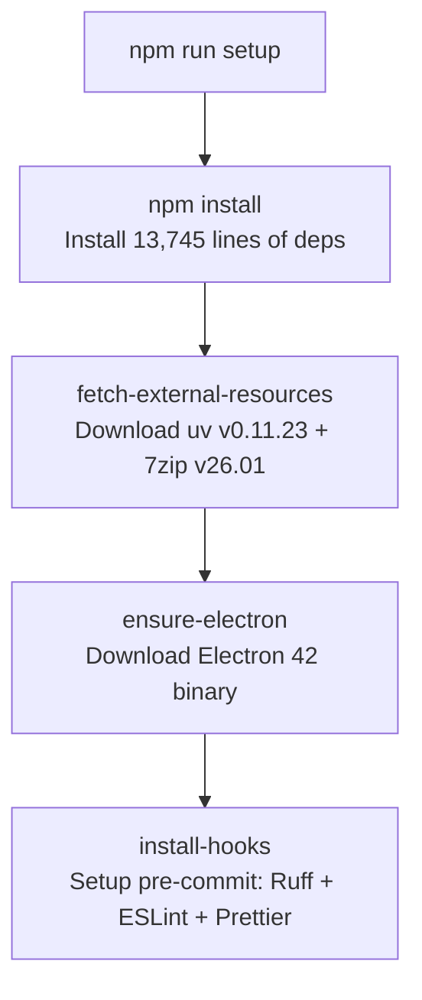

# Development Workflow (Linux)

## Prerequisites

| Requirement | Version | Purpose |
|-------------|---------|---------|
| Node.js | 24+ | Electron build toolchain |
| npm | 10+ | Package management |
| git | any | ComfyUI cloning, version control |
| gcc/g++ | any | Some Python source wheels |
| make/cmake | any | Native extension builds |
| python3 | 3.12 | System Python (some backends need it) |

Optional (for GPU acceleration):
- Intel GPU drivers (Level Zero + Vulkan)
- `libfuse2` (for AppImage testing)
- `pkexec` / `polkit` (for graphical package installation)

---

## Initial Setup

```bash
# Clone the repository
git clone https://github.com/intel/AI-Playground.git
cd AI-Playground/WebUI

# Full setup: installs npm deps, downloads uv/7zip, provisions electron, installs hooks
npm run setup
```

### What `npm run setup` Does



---

## Running in Development Mode

```bash
cd WebUI
npm run dev
```

This starts:
1. **Vite dev server** on `http://127.0.0.1:25413` with HMR
2. **Electron** loading the dev server URL
3. **Debug tools** enabled (`VITE_DEBUG_TOOLS=true`)
4. On Linux: automatically passes `--no-sandbox` to Electron

### Dev Mode Environment Variables

| Variable | Value | Purpose |
|----------|-------|---------|
| `VITE_DEBUG_TOOLS` | `"true"` | Enable Electron DevTools |
| `VITE_PLATFORM_TITLE` | `"from Intel®"` | Branding text |
| `AIPG_DEBUGGING_PORT` | `29222` | Chrome DevTools remote debugging |

### Dev Mode File Resolution

In development, paths resolve to the project directory:
```typescript
const aipgBaseDir = app.isPackaged
  ? packagedResourcesRoot()          // ~/.local/share/ai-playground/resources/
  : path.join(__dirname, '../../../') // <project-root>/
```

---

## Project Structure for Development

```
AI-Playground/
├── WebUI/
│   ├── src/                    # Vue.js components and stores
│   │   ├── components/         # UI components
│   │   ├── stores/             # Pinia state stores
│   │   ├── views/              # Page-level views
│   │   └── assets/             # Static assets
│   ├── electron/               # Main process code
│   │   ├── main.ts             # Entry point
│   │   ├── preload.ts          # IPC bridge
│   │   └── subprocesses/       # Backend managers
│   ├── external/               # Dev-mode config files
│   │   ├── settings-dev.json   # Dev settings
│   │   ├── model_config.dev.json # Dev model paths
│   │   └── mcp-dev.json        # Dev MCP config
│   └── build/
│       └── resources/          # Downloaded binaries (uv, 7zip)
├── service/                    # Python backend (editable)
├── comfyui-deps/               # ComfyUI deps (editable)
├── home-agent/                 # Home agent (editable)
└── OpenVINO/                   # OpenVINO utils (editable)
```

---

## Common Development Tasks

### Running Type Checks

```bash
cd WebUI
npm run type-check    # vue-tsc --noEmit
```

### Running Tests

```bash
cd WebUI
npm run test          # vitest run (one-shot)
npm run test:watch    # vitest (watch mode)
```

### Linting & Formatting

```bash
cd WebUI
npm run lint          # ESLint --fix
npm run format        # Prettier --write
```

### Python Backend Linting

```bash
# From project root (uses pre-commit config)
pre-commit run ruff --all-files
```

---

## Backend Development

### Modifying the Flask Service

```bash
cd service/

# Create/update the venv
uv sync

# Run the service directly for testing
uv run python web_api.py --port 59000
```

### Modifying ComfyUI Dependencies

```bash
cd comfyui-deps/

# Add a new dependency
uv add some-package

# Update lockfile
uv lock

# Sync with specific extra
uv sync --extra cpu
```

### Testing Backend Communication

```bash
# Start the app in dev mode
cd WebUI && npm run dev

# In another terminal, test the AI backend API:
curl -H "X-AIPG-Auth: <token-from-logs>" http://127.0.0.1:59000/healthy
```

The auth token is logged at startup in the Electron console.

---

## Building for Linux

### Build AppImage + .deb

```bash
cd WebUI
npm run build:linux
```

Output lands in `build/electron/`:
- `AI Playground-3.1.2-beta.AppImage`
- `AI Playground-3.1.2-beta.deb`

### Testing the AppImage

```bash
chmod +x "build/electron/AI Playground-3.1.2-beta.AppImage"
./"build/electron/AI Playground-3.1.2-beta.AppImage"
```

### Testing the .deb

```bash
sudo dpkg -i "build/electron/AI Playground-3.1.2-beta.deb"
# Launch from desktop menu or:
/opt/AI\ Playground/ai-playground
```

---

## Debugging

### Electron Main Process

```bash
# Start with debug tools enabled (default in dev)
npm run dev

# Open DevTools: Ctrl+Shift+I in the app window
# Or attach VS Code debugger to port 29222
```

### Backend Logs

All backend stdout/stderr is captured by the Electron main process and written to app logs. In dev mode, check the terminal where `npm run dev` is running.

Log location (packaged):
```
~/.local/share/ai-playground/resources/logs/
```

### GPU Detection Debugging

The device detection functions log their results:
```
Linux Level Zero runtime: loader=true gpuDriver=true pciDevice=true → Intel GPU (XPU) enabled
Linux Vulkan loader detected — llama.cpp will use the GPU (ubuntu-vulkan-x64) build
```

### UV/Python Debugging

UV operations are heavily logged:
```
[uv.sync.comfyui-deps] Spawning UV process with command: sync --directory /path --project comfyui-deps --extra xpu
[uv.sync.comfyui-deps] UV: Resolved 200 packages in 1.5s
[uv.sync.comfyui-deps] UV: Installed 45 packages in 30s
```

---

## Pre-Commit Hooks

**File:** `.pre-commit-config.yaml`

| Hook | Scope | Action |
|------|-------|--------|
| Ruff lint | `service/`, `home-agent/` | Python linting |
| Ruff format | `service/`, `home-agent/` | Python formatting |
| ESLint | `WebUI/` | TypeScript/Vue linting |
| Prettier | `WebUI/` | TypeScript/Vue formatting |

### Running Manually

```bash
# All hooks on staged files
pre-commit run

# All hooks on all files
pre-commit run --all-files

# Specific hook
pre-commit run ruff --all-files
```

---

## Development Configuration Files

| File | Purpose |
|------|---------|
| `WebUI/external/settings-dev.json` | Dev-mode app settings |
| `WebUI/external/model_config.dev.json` | Dev-mode model paths |
| `WebUI/external/mcp-dev.json` | Dev-mode MCP servers |
| `WebUI/vite.config.mts` | Vite + Electron dev config |
| `WebUI/tsconfig.json` | TypeScript project config |
| `WebUI/vitest.config.ts` | Test runner config |
| `WebUI/eslint.config.ts` | ESLint flat config |
| `WebUI/tailwind.config.cjs` | TailwindCSS settings |

---

## Adding a New Backend (Guide)

1. **Create Python project:**
   ```bash
   mkdir new-backend/
   # Create pyproject.toml with Python 3.12 requirement
   uv init --python 3.12
   uv add flask  # Add dependencies
   ```

2. **Create backend service class:**
   - Add `WebUI/electron/subprocesses/newBackendService.ts`
   - Implement `ApiService` interface
   - Handle Linux-specific paths and deps

3. **Register in service registry:**
   - Edit `WebUI/electron/subprocesses/apiServiceRegistry.ts`
   - Add port range and instantiation

4. **Add to build config:**
   - Add `extraResources` entry in `build/build-config.json`
   - Specify which files to bundle

5. **Add IPC handlers:**
   - Expose setup/start/stop via preload bridge
   - Add UI controls in Vue.js

---

## Useful Commands Reference

```bash
# Start development
cd WebUI && npm run dev

# Type check
cd WebUI && npm run type-check

# Run tests
cd WebUI && npm run test

# Lint everything
cd WebUI && npm run lint

# Build for Linux
cd WebUI && npm run build:linux

# Update Python deps (example: service)
cd service && uv lock && uv sync

# Check Python backend health
cd service && uv sync --check

# Download fresh external resources
cd WebUI && npm run fetch-external-resources
```
