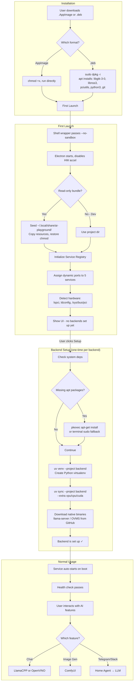
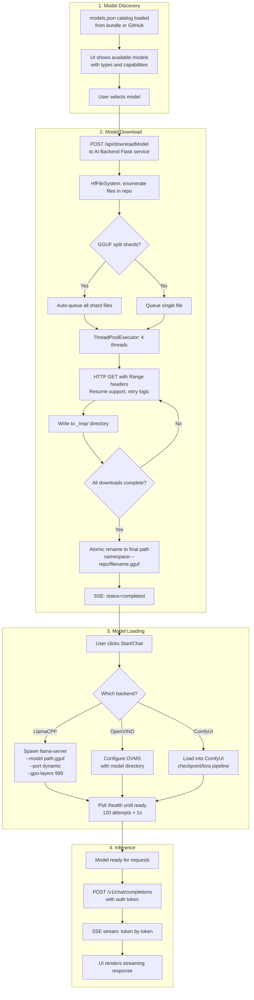
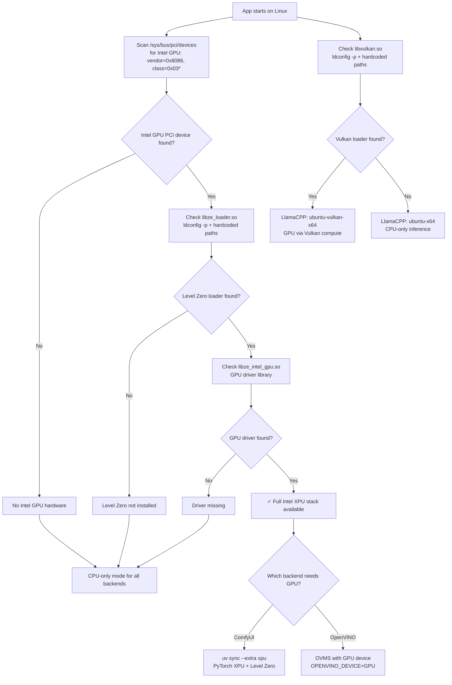
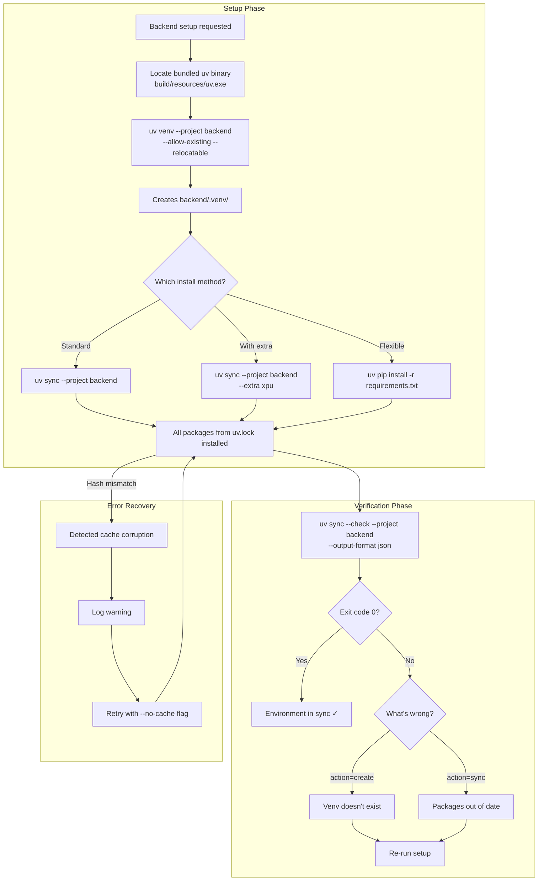
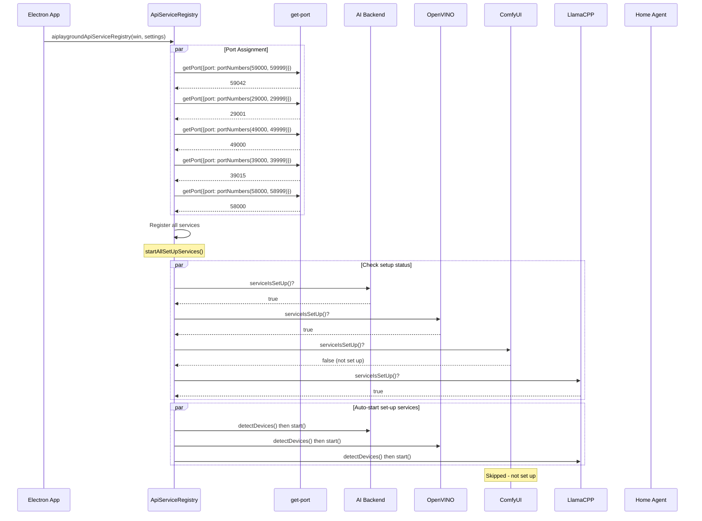
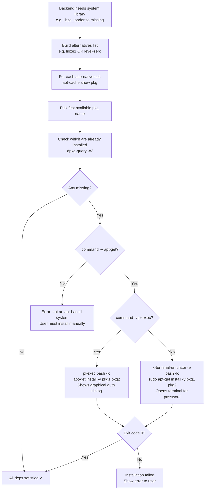
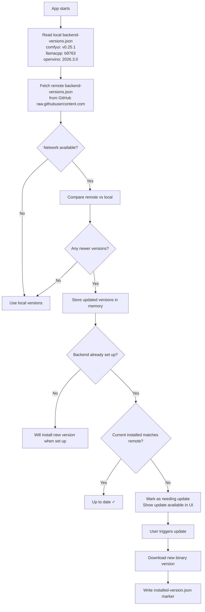
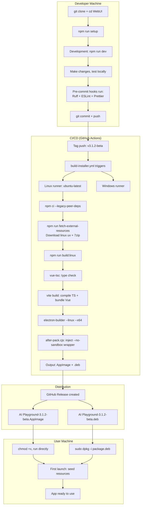
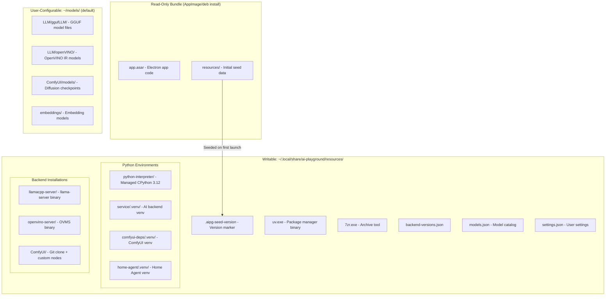

# End-to-End Workflow Diagrams

## Complete Application Lifecycle (Linux)



---

## Complete Model Download & Inference Pipeline



---

## GPU Detection & Backend Selection Decision Tree



---

## Python Environment Management Workflow



---

## Service Registry: Port Assignment & Startup



---

## Linux Package Installation Decision Flow



---

## Remote Version Update Flow



---

## Complete Build-to-Distribution Pipeline



---

## Data Persistence & Storage Layout



---

## Error Recovery Patterns

```mermaid
flowchart TD
    subgraph "UV Hash Mismatch Recovery"
        HM1[uv sync fails with hash mismatch] --> HM2[Detect via regex on error message]
        HM2 --> HM3[Log warning about cache corruption]
        HM3 --> HM4[Retry: uv sync --no-cache]
        HM4 --> HM5{Success?}
        HM5 -->|Yes| HM6[Continue normally]
        HM5 -->|No| HM7[Surface error to user]
    end

    subgraph "Backend Crash Recovery"
        CR1[Backend process exits unexpectedly] --> CR2[on-exit handler fires]
        CR2 --> CR3[Log exit code + stderr]
        CR3 --> CR4[Set status = 'failed']
        CR4 --> CR5[Send serviceInfoUpdate to renderer]
        CR5 --> CR6[UI shows error state]
        CR6 --> CR7[User can click Retry]
        CR7 --> CR8[service.start() again]
    end

    subgraph "Network Failure Recovery"
        NF1[Model download fails mid-stream] --> NF2[Download uses HTTP Range headers]
        NF2 --> NF3[On retry: resume from last byte]
        NF3 --> NF4[Temp dir preserved between retries]
    end

    subgraph "System Package Failure"
        SP1[pkexec install fails] --> SP2{Exit code?}
        SP2 -->|126 - dismissed| SP3[User cancelled auth dialog]
        SP2 -->|!= 0| SP4[Package not available or broken deps]
        SP3 --> SP5[Try terminal fallback]
        SP4 --> SP6[Parse apt output for specifics]
        SP6 --> SP7[Show actionable error to user]
    end
```
